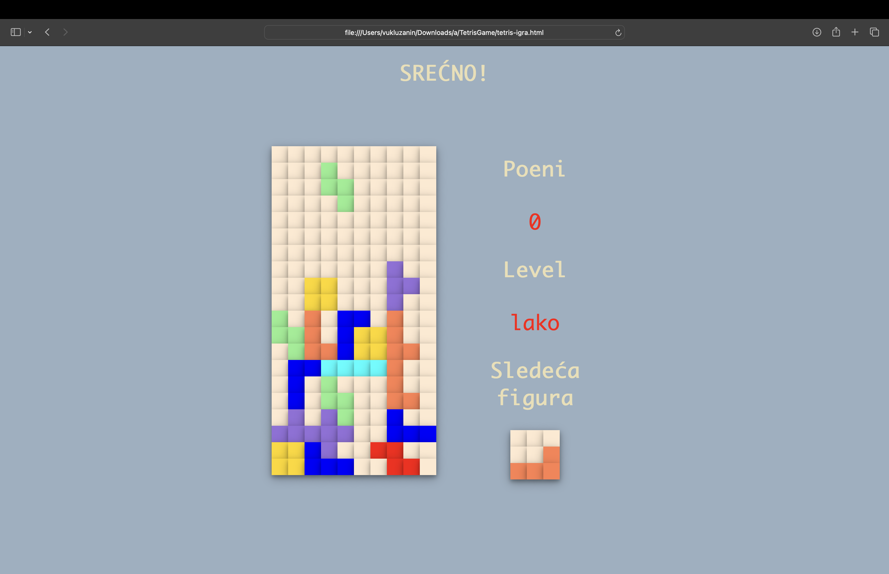

# Tetris Game

A simple **Tetris** game built with **HTML**, **JavaScript**, and **CSS**. The game features block movement, line clearing, and score tracking. 

## Features

- Move, rotate, and drop blocks. 🔲↔️⏬
- Clear full lines and earn points. 💥
- Responsive design for both desktop and mobile devices. 📱💻
- Track your score as you play. 📊

## How to Run

1. Clone or download the repository. 📥
    ```bash
    git clone PROJECT_URL

2. Navigate to project and open the `index.html` file in a web browser (for MacOS). 
    ```bash
    open index.html 

2. For Windows. 
    ```bash
    start index.html 

3. Start playing and enjoy! 🎉

## Technologies Used

This game is built using the following technologies:

- **HTML** for the game structure. 
- **CSS** for styling and visuals. 
- **JavaScript** for game logic and interactivity. 

## 🖼️ Screenshot


